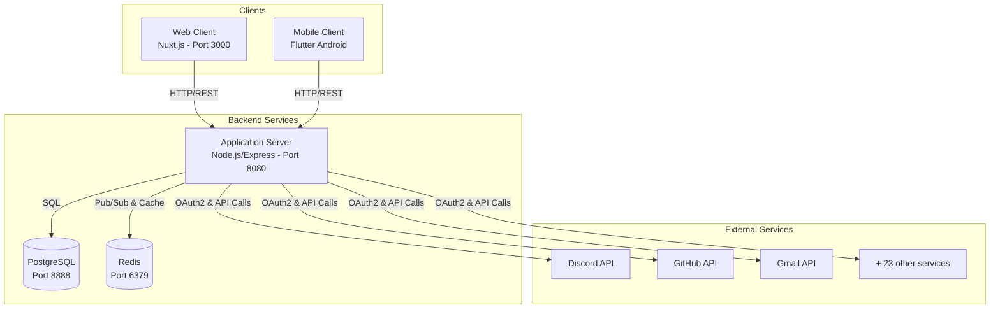
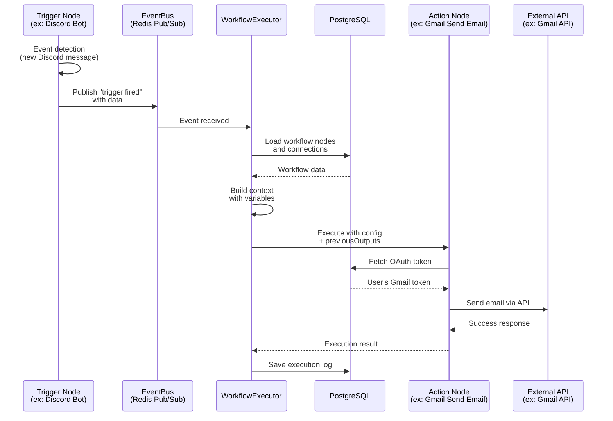
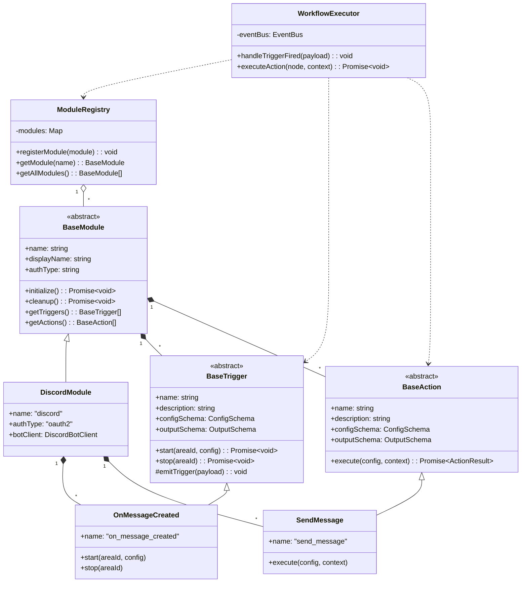
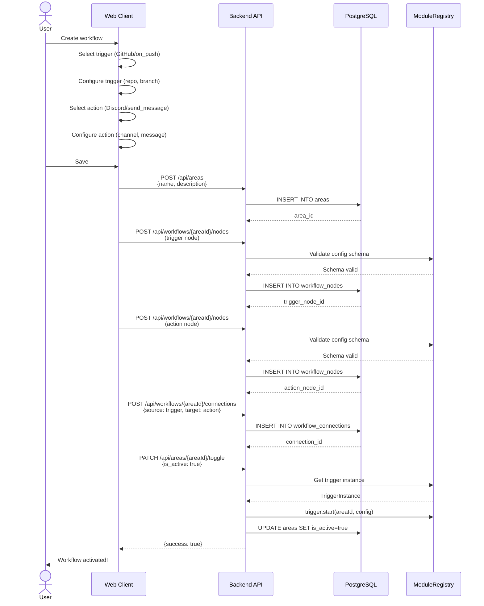
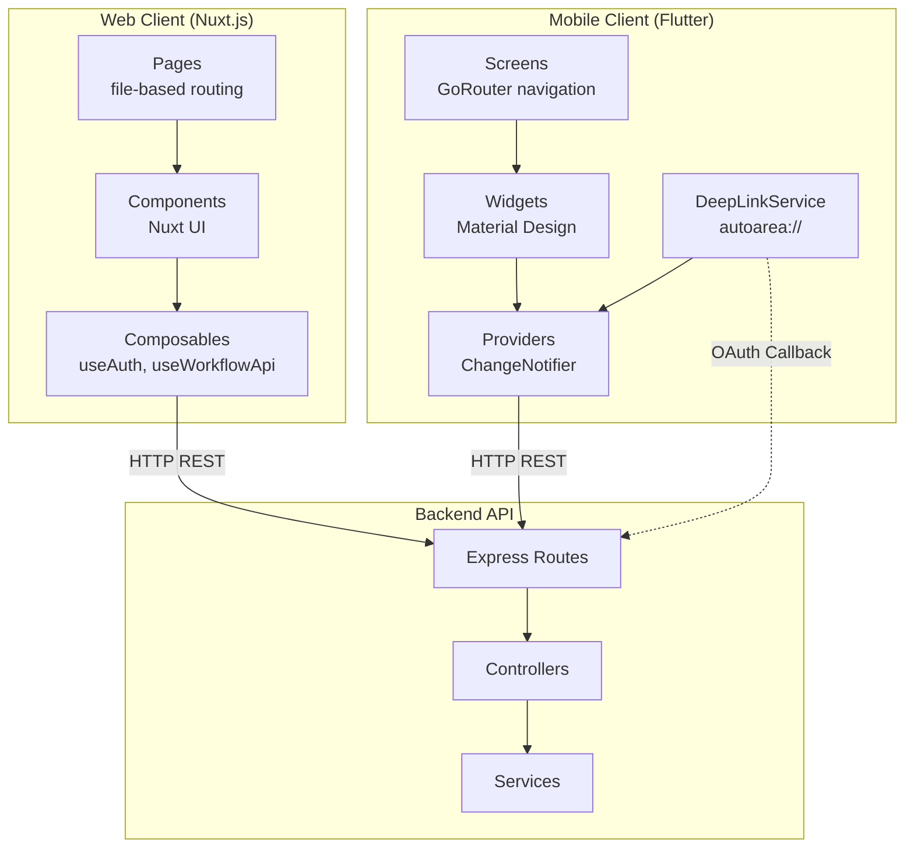

# AREA - Action REAction Automation Platform

<div align="center">


**A modern automation platform to connect your favorite services**

[](https://www.typescriptlang.org/)
[](https://nodejs.org/)
[](https://nuxt.com/)
[](https://flutter.dev/)
[](https://www.postgresql.org/)
[](https://redis.io/)
[](https://www.docker.com/)

</div>

---

## Table of Contents

- [About](#about)
- [Features](#features)
- [System Architecture](#system-architecture)
- [Tech Stack](#tech-stack)
- [Prerequisites](#prerequisites)
- [Installation](#installation)
- [Configuration](#configuration)
- [Usage](#usage)
- [Available Services](#available-services)
- [API Documentation](#api-documentation)
- [Diagrams](#diagrams)
- [User Guide](#user-guide)
- [Contributing](#contributing)
- [License](#license)

---

## About

**AREA** (Action-REAction) is an automation platform inspired by IFTTT and Zapier, allowing users to create automated workflows by connecting different digital services.

### Core Concept

The principle is simple: **if an ACTION occurs, then execute a REACTION**.

**Automation Examples:**
- **Gmail → Discord**: Receive an email with an attachment → Send a message on Discord
- **GitHub → Microsoft Teams**: An issue is created → Send a notification on Teams
- **Timer → Spotify**: Every morning at 8am → Play a Spotify playlist
- **Reddit → Gmail**: New post with a keyword → Receive an email

### Project Architecture

The project consists of **three main parts**:

1. **Application Server (Backend)** - Node.js/TypeScript server managing all business logic
2. **Web Client (Frontend)** - Nuxt.js web application to use AREA from the browser
3. **Mobile Client** - Flutter mobile application for Android

All business logic is centralized in the **backend**. The web and mobile clients are just user interfaces that communicate with the server via a **REST API**.

---

## Features

### User Management
- User registration with email/password
- OAuth2 authentication (Google, GitHub, Discord, etc.)
- User profile management
- Multi-service connections

### AREA Creation (Workflows)
- **Visual editor** with drag & drop interface (Web)
- **Simplified editor** for mobile
- Connection of triggers (actions) and actions (reactions)
- Dynamic configuration via automatically generated forms
- Variable substitution between nodes (e.g., `{{author.username}}`)
- Workflow activation/deactivation
- Execution history

### Supported Services
- **26 integrated services** (Discord, GitHub, Gmail, Spotify, Reddit, etc.)
- **50+ triggers and actions** in total
- Support for **3 types of triggers**:
  - **Webhooks** - Real-time events
  - **Polling** - Periodic verification
  - **Scheduled** - Scheduled trigger (cron)

### Security
- JWT authentication
- OAuth2 for service connections
- Password hashing with bcrypt
- Authentication middleware on all protected routes

---

## System Architecture

### Overview



### Workflow Execution Flow



### Modular Backend Architecture

The backend uses a **plugin-based architecture** where each service is an autonomous module:

```
backend/src/modules/
├── _base/
│   ├── BaseModule.ts          # Base class for all modules
│   ├── BaseTrigger.ts         # Base class for triggers
│   └── BaseAction.ts          # Base class for actions
├── discord/
│   ├── service.ts             # Discord module configuration
│   ├── triggers/
│   │   ├── OnMessageCreated.ts
│   │   ├── OnMemberJoin.ts
│   │   └── OnReactionAdded.ts
│   ├── actions/
│   │   ├── SendMessage.ts
│   │   ├── AddRole.ts
│   │   └── KickMember.ts
│   └── DiscordBotClient.ts    # Discord.js singleton client
├── github/
│   ├── service.ts
│   ├── triggers/
│   │   ├── OnPush.ts
│   │   ├── OnIssueOpened.ts
│   │   └── OnBranchCreated.ts
│   └── actions/ (to be implemented)
└── [25 other services...]
```

Each module:
- Extends `BaseModule`
- Defines its own triggers and actions
- Manages its own OAuth authentication
- Is completely independent from others

---

## Tech Stack

### Backend
- **Runtime**: Node.js 20+
- **Language**: TypeScript 5+
- **Framework**: Express 5
- **Database**: PostgreSQL 15
- **Cache & Pub/Sub**: Redis 7
- **Authentication**: JWT + bcryptjs
- **OAuth**: Custom OAuth2 clients for 15 providers
- **API Clients**: axios, googleapis, discord.js, etc.
- **Validation**: Joi
- **Logging**: Winston + Morgan

### Frontend Web
- **Framework**: Nuxt 4 (basé sur Vue 3)
- **UI Library**: Nuxt UI (TailwindCSS based)
- **State Management**: Composition API (useState)
- **Icons**: Heroicons, Lucide, Logos
- **HTTP Client**: Nuxt $fetch (auto-imported)
- **Router**: Nuxt Router (file-based routing)

### Mobile
- **Framework**: Flutter 3.7+
- **Language**: Dart 3.7+
- **State Management**: Provider
- **Routing**: GoRouter
- **HTTP Client**: http package
- **OAuth/Deep Linking**: url_launcher + app_links

### Infrastructure
- **Containerization**: Docker + Docker Compose
- **Reverse Proxy**: Nginx (production)
- **CI/CD**: Docker multi-stage builds
- **Environments**: dev, dev-db, prod, mobile profiles

---

## Prerequisites

Before starting, make sure you have installed:

- **Docker** (version 20.10+) and **Docker Compose** (version 2.0+)
- **Node.js** (version 20+) - for local development without Docker
- **Git** to clone the repository

**Optional (for local development without Docker):**
- **PostgreSQL** (version 15+)
- **Redis** (version 7+)
- **Flutter SDK** (version 3.7+) - for mobile development

---

## Installation

### 1. Clone the repository

```bash
git clone https://github.com/100-6/Mirror-Area.git
cd Mirror-Area
```

### 2. Environment configuration

Copy the `.env.example` file to `.env`:

```bash
cp .env.example .env
```

Then, **edit the `.env` file** to configure:

#### Required variables

```env
# Database
BACKEND_DB_PASSWORD=your_secure_password

# JWT Secret (generate with the command below)
BACKEND_JWT_SECRET=your_very_long_and_random_jwt_secret
```

**Generate a secure JWT secret:**

```bash
node -e "console.log(require('crypto').randomBytes(256).toString('base64'));"
```

#### OAuth variables (optional but recommended)

To enable OAuth services, you need to create OAuth applications on each platform and fill in the corresponding credentials:

```env
# Google OAuth (for login + Gmail)
GOOGLE_CLIENT_ID=your_client_id.apps.googleusercontent.com
GOOGLE_CLIENT_SECRET=your_client_secret

# GitHub OAuth
GITHUB_CLIENT_ID=your_github_client_id
GITHUB_CLIENT_SECRET=your_github_client_secret

# Discord OAuth + Bot
DISCORD_CLIENT_ID=your_discord_client_id
DISCORD_CLIENT_SECRET=your_discord_client_secret
DISCORD_BOT_TOKEN=your_discord_bot_token

# ... and other services (see .env.example for complete list)
```

**OAuth application creation guide:**
- [Google OAuth](https://console.cloud.google.com/apis/credentials)
- [GitHub OAuth](https://github.com/settings/developers)
- [Discord OAuth](https://discord.com/developers/applications)
- See [backend/docs/](backend/docs/) for detailed guides per service

### 3. Launch the application with Docker

#### Development mode (with hot-reload)

```bash
docker compose --profile dev up --build
```

This command launches:
- PostgreSQL (port 8888)
- Redis (port 6379)
- Backend in dev mode with nodemon (port 8080)
- Frontend in dev mode with hot-reload (port 3000)

**Access the application:**
- Web: [http://localhost:3000](http://localhost:3000)
- API: [http://localhost:8080](http://localhost:8080)
- Health check: [http://localhost:8080/api/health](http://localhost:8080/api/health)
- API Discovery: [http://localhost:8080/about.json](http://localhost:8080/about.json)

#### Production mode

```bash
docker compose --profile prod up --build -d
```

Launches the application with:
- PostgreSQL
- Redis
- Optimized backend (TypeScript compilation)
- Optimized frontend (SSR build)
- Nginx reverse proxy (ports 80/443)

#### Database only (for local development)

If you want to develop locally without Docker for backend/frontend:

```bash
docker compose --profile dev-db up -d
```

Launches only PostgreSQL and Redis.

#### Mobile build (Android APK)

```bash
docker compose --profile mobile up --build
```

This command:
1. Builds the Flutter application in release mode
2. Generates the **app-release.apk** file
3. Exports the APK to `./mobile_builds/`

The APK file will be accessible at: `./mobile_builds/app-release.apk`

### 4. Verify everything works

```bash
# Check running services
docker compose ps

# View logs
docker compose logs -f

# Logs for a specific service
docker compose logs -f backend-dev
docker compose logs -f frontend-dev
```

### 5. Database initialization

The database is automatically initialized on first launch via the SQL script:

`docker/postgres/init-db.sql`

This script creates:
- All necessary tables
- Indexes to optimize performance
- Relations and constraints

No manual intervention needed!

---

## Configuration

### Main environment variables

#### Backend

| Variable | Description | Default value | Required |
|----------|-------------|---------------|----------|
| `NODE_ENV` | Environment (development/production) | `development` | Yes |
| `BACKEND_PORT` | Backend server port | `8080` | No |
| `BACKEND_DB_HOST` | PostgreSQL host | `localhost` | Yes |
| `BACKEND_DB_PORT` | PostgreSQL port | `8888` | Yes |
| `BACKEND_DB_NAME` | Database name | `area_db` | Yes |
| `BACKEND_DB_USER` | PostgreSQL user | `area_user` | Yes |
| `BACKEND_DB_PASSWORD` | PostgreSQL password | - | Yes |
| `BACKEND_JWT_SECRET` | Secret to sign JWTs | - | Yes |
| `BACKEND_JWT_EXPIRES_IN` | Access token lifetime | `1d` | No |
| `REDIS_HOST` | Redis host | `localhost` | Yes |
| `REDIS_PORT` | Redis port | `6379` | Yes |
| `FRONTEND_URL` | Frontend URL (for OAuth redirects) | `http://localhost:3000` | Yes |

#### Frontend

| Variable | Description | Default value |
|----------|-------------|---------------|
| `FRONTEND_PORT` | Nuxt server port | `3000` |
| `NUXT_PUBLIC_API_URL` | Public API URL (client-side) | `http://localhost:8080` |
| `BACKEND_URL` | Internal API URL (SSR) | `http://area_backend_dev:8080` |

#### Mobile

| Variable | Description | Default value |
|----------|-------------|---------------|
| `MOBILE_API_URL` | API URL for mobile app | `https://area-eric.eliasdrissi.dev` |

This variable is used during APK build and is **compiled into the application**. To change the URL after build, you need to rebuild the APK.

#### OAuth Providers

For each OAuth service, three variables are needed:

```env
{SERVICE}_CLIENT_ID=...
{SERVICE}_CLIENT_SECRET=...
{SERVICE}_REDIRECT_URI=http://localhost:8080/api/auth/{service}/callback
```

**Supported services:**
- Google (login + Gmail)
- GitHub
- GitLab
- Discord
- Dropbox
- Outlook
- Spotify
- Reddit
- Strava
- Slack
- Bitly
- Twitch

See [.env.example](.env.example) for the complete list.

### Advanced configuration

#### Redis (docker/redis/redis.conf)

```conf
# Max memory and eviction policy
maxmemory 256mb
maxmemory-policy allkeys-lru

# Persistence
save 900 1
save 300 10
save 60 10000
```

---

## Usage

### 1. Registration / Login

#### Via Email/Password

1. Go to [http://localhost:3000/register](http://localhost:3000/register)
2. Fill in the registration form
3. Log in at [http://localhost:3000/login](http://localhost:3000/login)

#### Via OAuth (Google, GitHub, Discord, etc.)

1. On the login page, click on the desired provider button
2. Authorize the application on the provider's page
3. You are automatically redirected and logged in

### 2. Connect services

Before creating workflows, you need to connect the services you want to use.

1. Go to your **profile** (`/me`)
2. "Connected services" section
3. Click "Connect" next to the desired service
4. Authorize the application via OAuth
5. The service is now connected and ready to use

**Available services**: Discord, GitHub, Gmail, Dropbox, Spotify, Reddit, etc.

### 3. Create a workflow (AREA)

#### On Web

1. Click "Create a workflow" from the dashboard
2. **Add a trigger**:
   - Select a service (e.g., GitHub)
   - Choose a trigger (e.g., "On Push")
   - Configure parameters (e.g., repository, branch)
3. **Add an action**:
   - Click "Add an action"
   - Select a service (e.g., Discord)
   - Choose an action (e.g., "Send Message")
   - Configure parameters (e.g., channel, message)
4. **Use variables**:
   - In the configuration, click on available variable badges
   - Example: `Message: "New commit from {{pusher}} on {{branch}}"`
5. **Save and activate** the workflow

#### On Mobile

1. "AREA" tab → "Create"
2. Same process as web but with a mobile-adapted interface
3. The mobile editor is more simplified (list instead of canvas)

### 4. Manage workflows

- **Dashboard**: Overview of all your workflows
- **Activate/Deactivate**: Toggle to enable or disable a workflow
- **History**: View past executions with their status (success/failure)
- **Edit**: Edit an existing workflow configuration
- **Delete**: Permanently delete a workflow

### 5. Monitor execution

Each time a workflow triggers:
1. The trigger detects the event
2. The action is automatically executed
3. The result is recorded in history
4. You can view execution logs

**Access history:**
- Web: Dashboard → Click on a workflow → "History" tab
- Mobile: AREA → Select a workflow → "History"

---

## Available Services

The system currently supports **26 services** with **50+ triggers and actions**:

### Services with OAuth2

| Service | Triggers | Actions | Authentication |
|---------|----------|---------|----------------|
| **Discord** | `on_message_created`, `on_member_join`, `on_reaction_added` | `send_message`, `add_role`, `kick_member`, `send_webhook_message` | OAuth2 + Bot Token |
| **GitHub** | `on_push`, `on_branch_created`, `on_branch_deleted`, `on_issue_opened`, `on_issue_closed` | Coming soon | OAuth2 |
| **Gmail** | `on_new_email`, `on_labeled_email` | `send_email`, `add_label`, `mark_as_read`, `move_to_trash` | OAuth2 |
| **Outlook** | `on_new_email`, `on_calendar_event` | `send_email`, `create_calendar_event` | OAuth2 |
| **Spotify** | `on_new_track_in_playlist`, `on_track_saved` | `play_track`, `add_to_playlist`, `pause_playback` | OAuth2 |
| **Reddit** | `on_new_post_in_subreddit`, `on_new_comment` | `submit_post`, `submit_comment`, `upvote` | OAuth2 |
| **Strava** | `on_new_activity` | `create_activity` | OAuth2 |
| **Slack** | `on_message_in_channel` | `send_message`, `create_channel` | OAuth2 |
| **Bitly** | - | `create_short_link` | OAuth2 |
| **Twitch** | `on_stream_start`, `on_stream_end` | - | OAuth2 |
| **Dropbox** | `on_new_file`, `on_file_shared` | `upload_file`, `share_file`, `delete_file` | OAuth2 |
| **Trello** | `on_card_created`, `on_card_moved` | `create_card`, `move_card`, `add_comment` | OAuth2 (hash fragment flow) |
| **GitLab** | `on_push`, `on_issue_opened`, `on_merge_request` | `create_issue`, `create_merge_request` | OAuth2 |

### Services with API Key

| Service | Triggers | Actions | Authentication |
|---------|----------|---------|----------------|
| **OpenAI** | - | `generate_text`, `generate_image` | API Key |
| **Weather** | - | `get_current_weather`, `get_forecast` | API Key (OpenWeatherMap) |
| **Crypto** | `on_price_change` | `get_crypto_price` | None (public API) |
| **Currency** | - | `convert_currency` | API Key (exchangerate-api) |
| **Books** | - | `search_books` | API Key (Google Books) |
| **AppleMusic** | - | `search_track`, `get_track_info` | API Key |
| **Shodan** | - | `host_lookup`, `search` | API Key |

### Services without authentication

| Service | Triggers | Actions | Authentication |
|---------|----------|---------|----------------|
| **Timer** | `on_schedule`, `on_cron`, `on_daily_at_time` | - | None |
| **RSS** | `on_new_item` | - | None |
| **Webhook** | `on_webhook_received` | `send_webhook` | None |
| **Console** | - | `log_message` | None |
| **Ntfy** | - | `send_notification` | None |

### Services with Bot Token

| Service | Triggers | Actions | Authentication |
|---------|----------|---------|----------------|
| **Telegram** | `on_message`, `on_command` | `send_message`, `send_photo` | Bot Token |

### Popular workflow examples

1. **GitHub → Discord**
   - Trigger: `on_push`
   - Action: `send_message`
   - Use case: Notify team of each new commit

2. **Gmail → Dropbox**
   - Trigger: `on_new_email` (with attachment)
   - Action: `upload_file`
   - Use case: Automatically save attachments

3. **Timer → Spotify**
   - Trigger: `on_daily_at_time` (8:00 AM)
   - Action: `play_track`
   - Use case: Automatic music alarm

4. **Reddit → Gmail**
   - Trigger: `on_new_post_in_subreddit`
   - Action: `send_email`
   - Use case: Receive an email for each new post in a subreddit

5. **Strava → Discord**
   - Trigger: `on_new_activity`
   - Action: `send_message`
   - Use case: Share sports activities with the community

---

## API Documentation

### Discovery endpoint (about.json)

**According to the EPITECH specification**, the server exposes a service discovery endpoint:

**GET** `http://localhost:8080/about.json`

**Response:**

```json
{
  "client": {
    "host": "10.101.53.35"
  },
  "server": {
    "current_time": 1531680780,
    "services": [
      {
        "name": "discord",
        "actions": [
          {
            "name": "on_message_created",
            "description": "Fires when a message is posted in a channel"
          }
        ],
        "reactions": [
          {
            "name": "send_message",
            "description": "Send a text message to a Discord channel"
          }
        ]
      }
    ]
  }
}
```

### Main endpoints

#### Authentication

```
POST   /api/auth/register          # Registration
POST   /api/auth/login             # Login
POST   /api/auth/logout            # Logout
POST   /api/auth/refresh           # Refresh token
GET    /api/auth/verify            # Verify token validity
GET    /api/auth/{provider}        # Initiate OAuth (Google, GitHub, etc.)
GET    /api/auth/{provider}/callback  # OAuth callback
```

#### Users

```
GET    /api/users/me               # User profile
PUT    /api/users/me               # Update profile
GET    /api/users/me/connections   # OAuth connections
DELETE /api/users/me/connections/:id  # Disconnect a service
```

#### Workflows (AREAs)

```
GET    /api/areas                  # List workflows
POST   /api/areas                  # Create workflow
GET    /api/areas/:id              # Workflow details
PUT    /api/areas/:id              # Update
DELETE /api/areas/:id              # Delete
POST   /api/areas/:id/toggle       # Activate/deactivate
GET    /api/areas/:id/executions   # Execution history
```

#### Workflow Nodes

```
GET    /api/workflows/:areaId/nodes        # Workflow nodes
POST   /api/workflows/:areaId/nodes        # Create node
PUT    /api/workflows/:areaId/nodes/:id    # Update node
DELETE /api/workflows/:areaId/nodes/:id    # Delete node
GET    /api/workflows/:areaId/connections  # Connections between nodes
POST   /api/workflows/:areaId/connections  # Create connection
DELETE /api/workflows/:areaId/connections/:id  # Delete connection
```

#### Modules (Services)

```
GET    /api/modules                        # List all services
GET    /api/modules/:name                  # Service details
GET    /api/modules/:name/actions          # Available triggers
GET    /api/modules/:name/reactions        # Available actions
```

### Detailed documentation per service

Complete guides are available for each service in the [backend/docs/](backend/docs/) folder:

- [API_MODULE_VARIABLES.md](backend/docs/API_MODULE_VARIABLES.md) - Variable system
- [GITHUB_API_USAGE.md](backend/docs/GITHUB_API_USAGE.md) - GitHub integration
- [DROPBOX_API_USAGE.md](backend/docs/DROPBOX_API_USAGE.md) - Dropbox integration
- [TRELLO_API_USAGE.md](backend/docs/TRELLO_API_USAGE.md) - Trello integration

---

## Diagrams

### Class diagram (Backend)



### Sequence diagram: Workflow creation



### Architecture diagram: Frontend/Mobile



---

## User Guide

### Complete User Journey

This diagram shows the complete user journey through the AREA platform, from initial authentication to creating and managing workflows.

```mermaid
graph TB
    Start([User arrives on AREA]) --> Login{Already registered?}

    Login -->|No| Register[Register Page]
    Login -->|Yes| LoginPage[Login Page]

    Register --> RegChoice{Registration method?}
    RegChoice -->|Email/Password| EmailReg[Fill registration form]
    RegChoice -->|OAuth| OAuthReg[Choose provider:<br/>Google, GitHub, Discord, etc.]

    EmailReg --> Dashboard
    OAuthReg --> OAuthAuth[Authorize on provider]
    OAuthAuth --> Dashboard

    LoginPage --> LoginChoice{Login method?}
    LoginChoice -->|Email/Password| EmailLogin[Enter credentials]
    LoginChoice -->|OAuth| OAuthLogin[Choose provider]

    EmailLogin --> Dashboard[Dashboard]
    OAuthLogin --> OAuthAuth2[Authorize on provider]
    OAuthAuth2 --> Dashboard

    Dashboard --> DashChoice{What to do?}

    DashChoice -->|Create workflow| CreateWorkflow[Create new AREA]
    DashChoice -->|View workflows| ViewWorkflows[View all workflows]
    DashChoice -->|Connect services| ConnectServices[Go to Profile]
    DashChoice -->|Manage profile| Profile[Profile Page]
    DashChoice -->|Download app| Download[Download APK]

    CreateWorkflow --> SelectTrigger[Select Trigger<br/>Service + Event]
    SelectTrigger --> ConfigTrigger[Configure trigger<br/>parameters]
    ConfigTrigger --> SelectAction[Select Action<br/>Service + Action]
    SelectAction --> ConfigAction[Configure action<br/>Use variables from trigger]
    ConfigAction --> SaveWorkflow[Save & Activate]
    SaveWorkflow --> Dashboard

    ViewWorkflows --> WorkflowActions{Action?}
    WorkflowActions -->|Edit| EditWorkflow[Edit workflow]
    WorkflowActions -->|Activate/Deactivate| ToggleWorkflow[Toggle status]
    WorkflowActions -->|View history| ViewHistory[Execution history]
    WorkflowActions -->|Delete| DeleteWorkflow[Delete workflow]

    EditWorkflow --> Dashboard
    ToggleWorkflow --> Dashboard
    ViewHistory --> Dashboard
    DeleteWorkflow --> Dashboard

    ConnectServices --> Profile
    Profile --> ProfileChoice{What to manage?}

    ProfileChoice -->|Edit info| EditProfile[Edit username/email]
    ProfileChoice -->|Change password| ChangePassword[Change password]
    ProfileChoice -->|Connect services| LinkService[Link OAuth service]
    ProfileChoice -->|Disconnect services| UnlinkService[Disconnect service]
    ProfileChoice -->|Delete account| DeleteAccount[Delete account]

    EditProfile --> Profile
    ChangePassword --> Profile
    LinkService --> OAuthLink[Authorize service]
    OAuthLink --> Profile
    UnlinkService --> Profile
    DeleteAccount --> Confirmation[Type SUPPRIMER]
    Confirmation --> Logout[Logout & redirect]

    Download --> DownloadAPK[Download Android APK]
    DownloadAPK --> Dashboard

    Profile --> Dashboard

    style Start fill:#e1f5ff
    style Dashboard fill:#d4edda
    style CreateWorkflow fill:#fff3cd
    style Profile fill:#f8d7da
    style SaveWorkflow fill:#d1ecf1
    style Logout fill:#f8d7da
```



### Key Features Explained

#### 1. Authentication
- **Email/Password**: Traditional registration with email verification
- **OAuth Providers**: One-click sign-up with Google, GitHub, Discord, and more
- **Secure**: JWT tokens with automatic refresh

#### 2. Dashboard
- **Workflow Overview**: See all your active and inactive workflows
- **Quick Actions**: Create, edit, activate/deactivate workflows
- **Execution History**: Monitor workflow runs and debug issues

#### 3. Workflow Creation
- **Trigger Selection**: Choose from 50+ triggers across 26 services
- **Action Configuration**: Set up automated actions with dynamic parameters
- **Variable System**: Use data from triggers in your actions (e.g., `{{author.username}}`)
- **Visual Editor**: Drag-and-drop interface on web, simplified list on mobile

#### 4. Service Management
- **OAuth Integration**: Securely connect your accounts
- **Multi-Service Support**: Link multiple services to create complex automations
- **Easy Disconnection**: Revoke access anytime from your profile

#### 5. Profile Management
- **Edit Information**: Update username, email, and avatar
- **Password Change**: Secure password update with current password verification
- **Connected Services**: View and manage all linked OAuth accounts
- **Account Deletion**: Permanently delete your account with confirmation

#### 6. Mobile App
- **Android APK**: Download the mobile app directly from the platform
- **Full Features**: All web features available on mobile
- **Deep Linking**: OAuth callbacks work seamlessly with the mobile app

---

## Contributing

Do you want to add a new service, trigger, or action? Check out our detailed guide:

**[HOWTOCONTRIBUTE.md](HOWTOCONTRIBUTE.md)**

This guide explains:
- How to add a new service
- How to create a new trigger
- How to create a new action
- Code best practices
- Testing and validation process

---

## Project Structure

```
Mirror-Area/
├── backend/                    # Application server (Node.js/TypeScript)
│   ├── src/
│   │   ├── core/              # Routes, controllers, middleware
│   │   ├── modules/           # Services (Discord, GitHub, Gmail, etc.)
│   │   ├── workflow-engine/   # Workflow execution engine
│   │   └── shared/            # Shared utilities
│   ├── docs/                  # Detailed API documentation
│   ├── Dockerfile
│   └── package.json
├── frontend/                   # Web application (Nuxt.js)
│   ├── app/
│   │   ├── pages/             # Pages (automatic routing)
│   │   ├── components/        # Nuxt components
│   │   ├── composables/       # Nuxt composables
│   │   └── assets/            # Styles, images
│   ├── nuxt.config.ts
│   ├── Dockerfile
│   └── package.json
├── mobile/                     # Mobile application (Flutter)
│   ├── lib/
│   │   ├── core/              # Services, constants
│   │   ├── features/          # Functional modules
│   │   └── shared/            # Shared widgets
│   ├── android/               # Android configuration
│   ├── pubspec.yaml
│   └── Dockerfile
├── docker/                     # Docker configuration
│   ├── postgres/
│   │   └── init-db.sql        # DB initialization script
│   ├── redis/
│   │   └── redis.conf
│   └── nginx/
│       └── nginx.conf
├── docker-compose.yml          # Service orchestration
├── .env.example                # Configuration template
├── README.md                   # This file
└── HOWTOCONTRIBUTE.md          # Contribution guide
```

---

## Troubleshooting

### Problem: Containers won't start

**Solution:**
```bash
# Check logs
docker compose logs

# Rebuild images
docker compose --profile dev build --no-cache

# Clean containers/volumes
docker compose down -v
docker compose --profile dev up --build
```

### Problem: PostgreSQL refuses connection

**Possible causes:**
- Container not ready (healthcheck)
- Wrong password in `.env`

**Solution:**
```bash
# Check DB status
docker compose ps

# Check PostgreSQL logs
docker compose logs postgres_db

# Connect manually to test
docker compose exec postgres_db psql -U area_user -d area_db
```

### Problem: OAuth doesn't work

**Possible causes:**
- Incorrect Client ID / Secret
- Misconfigured redirect URI

**Solution:**
1. Verify environment variables are correctly set
2. Verify the redirect URI in `.env` matches the one configured in the OAuth application
3. For local development: `http://localhost:8080/api/auth/{service}/callback`
4. For production: `https://your-domain.com/api/auth/{service}/callback`

### Problem: Mobile can't connect to backend

**Solution:**
1. Verify `MOBILE_API_URL` in `.env` points to a URL accessible from mobile
2. For Android emulator: use `http://10.0.2.2:8080` instead of `localhost`
3. For physical device: use the local IP of the server (e.g., `http://192.168.1.10:8080`)
4. Rebuild APK after modifying `MOBILE_API_URL`

### Problem: Workflows don't trigger

**Possible causes:**
- Workflow not activated
- Trigger not properly configured
- OAuth connection issue

**Solution:**
```bash
# Check backend logs
docker compose logs -f backend-dev

# Check in DB that workflow is active
docker compose exec postgres_db psql -U area_user -d area_db -c "SELECT id, name, is_active FROM areas;"

# Check Redis logs (pub/sub)
docker compose logs -f redis
```

---

## Performance and Scalability

### Scalable architecture

The system is designed to scale horizontally:

- **Backend**: Can be duplicated (load balancer + multiple instances)
- **Redis Pub/Sub**: Enables communication between backend instances
- **PostgreSQL**: Can be configured with replication (master/slave)
- **Stateless**: JWT tokens allow authentication without server sessions

### Implemented optimizations

- **SQL indexes** on all foreign keys and frequently queried columns
- **Connection pooling** for PostgreSQL
- **Redis caching** for frequently accessed data
- **Lazy loading** of modules (loaded only when needed)
- **Compression** of HTTP responses (gzip)
- **Rate limiting** on external APIs (configurable per service)

---

## Security

### Implemented security measures

- **Bcrypt hashing** for passwords (salt rounds: 10)
- **JWT** with expiration (1 day by default)
- **Helmet.js** for security headers
- **CORS** configured (whitelist of allowed origins)
- **OAuth2** for external service connections
- **Encrypted tokens** in database
- **Input validation** with Joi
- **Logging** of all authentications

### Best practices

- Never **commit** the `.env` file with secrets
- Use **strong secrets** for `JWT_SECRET` (minimum 256 characters)
- Change **default passwords** for PostgreSQL
- Enable **HTTPS** in production (via Nginx)
- Configure **rate limiting** on sensitive endpoints

---

## License

This project is an academic project completed as part of the EPITECH curriculum.

**Authors:** Mirror-Area Team
**Year:** 2025-2026
**Module:** G-DEV-500 - AREA

---

## Support

For any questions or issues:

- **GitHub Issues**: [Create an issue](https://github.com/100-6/Mirror-Area/issues)
- **Documentation**: Check files in [backend/docs/](backend/docs/)
- **Contributing**: See [HOWTOCONTRIBUTE.md](HOWTOCONTRIBUTE.md)

---

<div align="center">

Made by the Mirror-Area team

[Back to top](#area---action-reaction-automation-platform)

</div>
